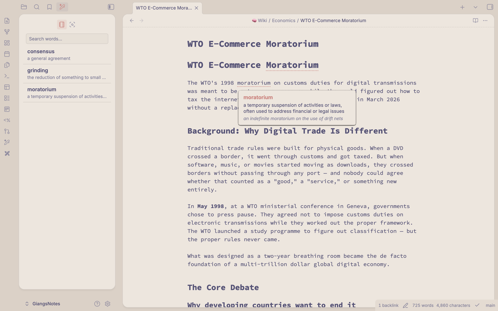
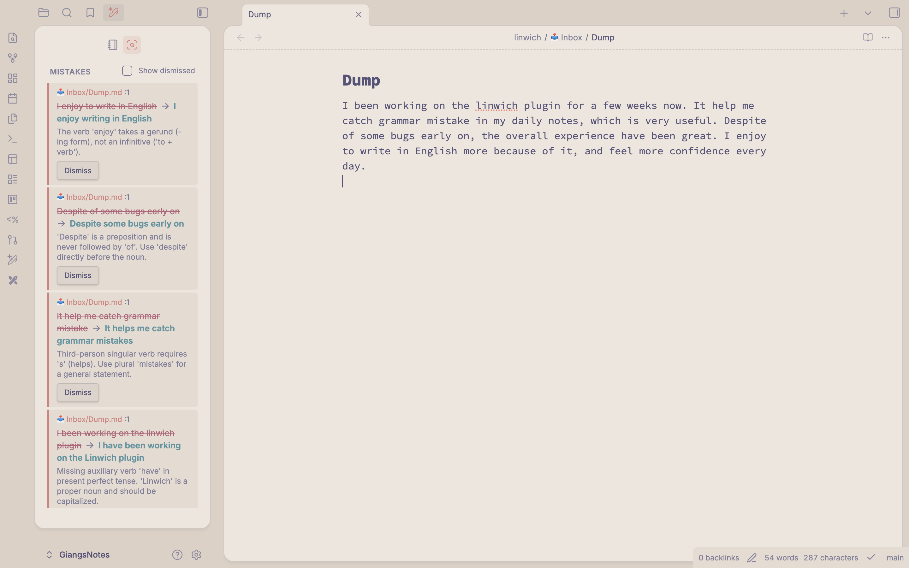

# Linwich — Obsidian Plugin

Vocabulary tracking and grammar mistake detection for non-native English speakers.

## Screenshots





## Features

- **Vocab sidebar** — Browse all saved vocabulary words with definitions, examples, and backlink counts. Click any word to open its note.
- **Add to Vocab** — Right-click any single word in the editor to save it with a definition and example sentence.
- **Vocab hover card** — Hover over any saved word in your notes to see its definition and example inline.
- **Mistake tracker** — Right-click in any note and choose "Check grammar" to send it to Claude for analysis. Mistakes are saved as notes and shown as dismissible cards in the sidebar.

## Requirements

- Obsidian 0.15.0 or later
- Desktop only (no mobile support)
- A Claude API key (Anthropic) for the grammar-check feature

## Installation

### Community Plugins (recommended)

1. Open Obsidian **Settings → Community plugins → Browse**.
2. Search for **Linwich**.
3. Click **Install**, then **Enable**.

### Manual Installation

1. Download the latest release from the [Releases page](../../releases).
2. Copy `main.js`, `manifest.json`, and `styles.css` into your vault at:
   ```
   <YourVault>/.obsidian/plugins/linwich/
   ```
3. Restart Obsidian and enable **Linwich** in **Settings → Community plugins**.

## Configuration

Open **Settings → Linwich**:

| Setting | Default | Description |
|---|---|---|
| Linwich folder | `linwich` | Root folder where Vocab and Mistakes sub-folders are created |
| Claude API key | _(empty)_ | Your Anthropic API key — required for grammar checking |

Get a Claude API key at [console.anthropic.com](https://console.anthropic.com).

## Usage

### Saving vocabulary
1. Select a single word in the editor.
2. Right-click → **Add to Vocab** (or **Edit in Vocab** if the word already exists).
3. Fill in the definition and optional example sentence.

### Checking grammar
1. Right-click anywhere in the note → **Check grammar** (or use the command palette).
2. Results appear in the **Mistakes** tab of the Linwich sidebar.
3. Click **Dismiss** on any card to archive it.

### Command palette
- `Linwich: Check grammar` — runs grammar check on the active note (assignable to a hotkey).
- `Linwich: Open Linwich sidebar` — opens the sidebar.

## Development

```bash
npm install
npm run dev      # watch mode
npm run build    # production build
npm run lint     # ESLint check
```

Built files: `main.js`, `manifest.json`, `styles.css`.

## License

MIT
